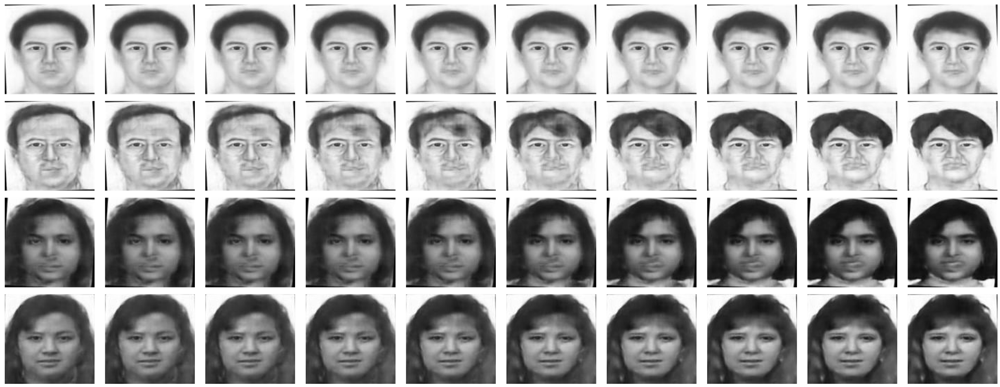
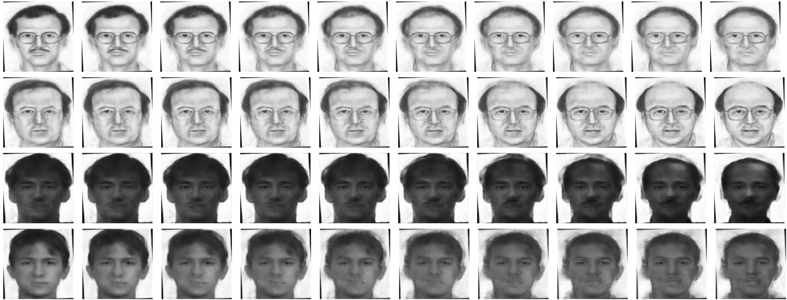
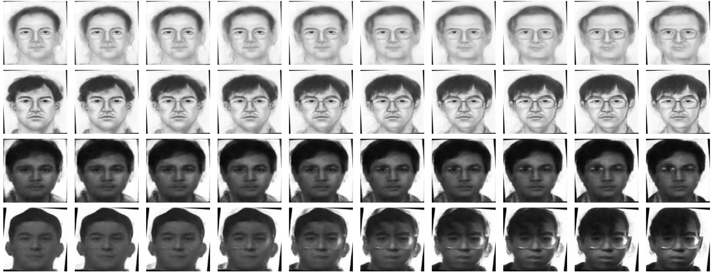

# CMDR-HFA
Cross Modality Disentangled Representation for Heterogeneous Face Analysis

We will realse the code in the future.

## Requirements
- Python 3.6
- pytorch1.1
- CUDA & GPU available device
## Experiments
### Video Demo

we supply the video of modality factor traversal results to show the continuous cross modality translation process clearly. In the video, the first three rows show input examples from training set and the fourth row shows input examples from testing set.

### Additonal results of modality factor traversal 

Additonal results of modality factor traversal on the CUFSF sketch database. Each row shows the face images generated by varying the latent modality factor of the same face image. The first fourth rows show results of input examples from training set and the last two rows show results of input examples from testing set.

###  Other Latent Factors Traversal Results

Here we present additional latent factors traversal results on CUFSF sketch dataset. Expect for the modality factor, we also show other discovered semantic factors which could control face attribute information. As show in Figure 2, Figure 3 and Figure 4, the discovered 24th factor, the 55th factor and the 114th factor could effectively control face attributes Bangs, Receding hairline and Eyeglasses. It inspires us to explore the cross modality face translation with guidance of face attributes in the future.

## Citation

